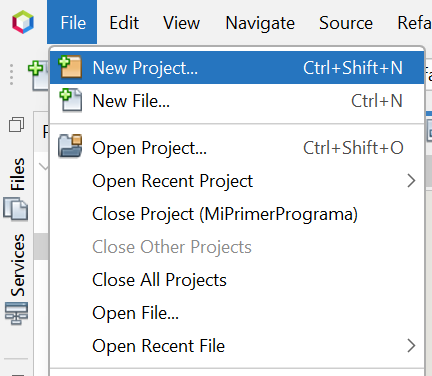
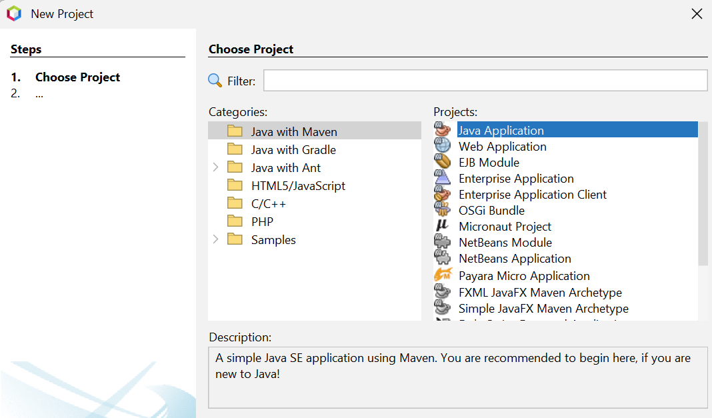
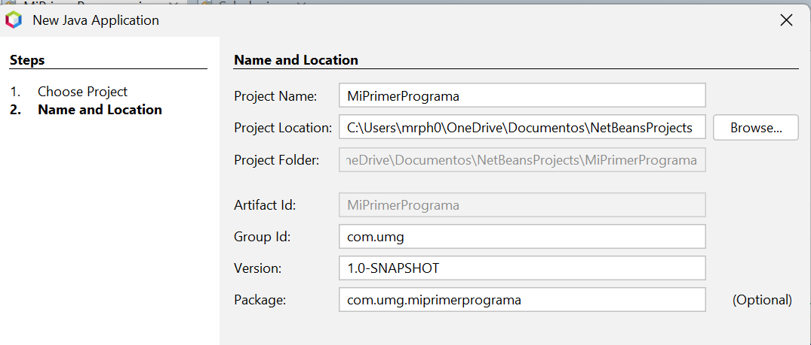
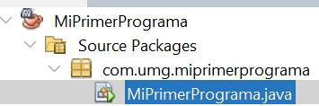

# Creación de un Proyecto en Apache NetBeans

Hasta ahora hemos compilado nuestro código manualmente utilizando la consola. Sin embargo, en el entorno profesional se utilizan herramientas llamadas **IDE** (Entorno de Desarrollo Integrado, por sus siglas en inglés). 

Un IDE como Apache NetBeans nos facilita la vida al escribir el código (autocompletado, resaltado de errores en tiempo real) y automatiza el proceso de compilación (`javac`) y ejecución (`java`) con un solo clic.

## Paso a Paso: Tu Primer Proyecto en NetBeans

### 1. Iniciar un Nuevo Proyecto
1. Abre Apache NetBeans.
2. En el menú superior, haz clic en **File** (Archivo) y luego en **New Project...** (Proyecto Nuevo). Alternativamente, puedes usar el ícono de la carpeta naranja con un signo `+` verde.



### 2. Seleccionar el Tipo de Proyecto
NetBeans utiliza gestores de proyectos para organizar el código. Nosotros utilizaremos el estándar moderno:
1. En la columna **Categories** (Categorías), selecciona la carpeta **Java with Maven**.
2. En la columna **Projects** (Proyectos), selecciona **Java Application** (Aplicación Java).
3. Haz clic en el botón **Next >** (Siguiente).



### 3. Configurar el Proyecto
En esta ventana definiremos los detalles de nuestro programa:
1. **Project Name:** Escribe el nombre del proyecto: `MiPrimerPrograma`. *(Nota: No utilices espacios en blanco).*
2. **Project Location:** Selecciona la carpeta donde deseas guardar tus tareas.
3. **Package:** NetBeans sugerirá un nombre de paquete por defecto (usualmente en minúsculas, como `com.miusuario.miprimerprograma`). Puedes dejarlo así.
4. Haz clic en **Finish** (Terminar).



## 4. Entendiendo la Interfaz
Una vez creado el proyecto, NetBeans abrirá automáticamente tu archivo `.java`. 



Verás un código muy similar a este, generado automáticamente:

```java
package com.miusuario.miprimerprograma;

public class MiPrimerPrograma {

    public static void main(String[] args) {
        System.out.println("Hello World!");
    }
}

```

* **`package ...;`**: Maven organiza obligatoriamente los archivos en "paquetes" (carpetas internas). Es muy importante **no borrar esta primera línea**.
* **`public static void main...`**: NetBeans ya te ha creado la estructura clásica y ha escrito un "Hello World!" por defecto dentro de las llaves del método principal.

## 5. Ejecutar el Proyecto

Para probar tu programa, modifica el texto dentro del `System.out.println` por tu propio mensaje:

```java
System.out.println("¡Hola Mundo desde Apache NetBeans!");

```

Para compilar y ejecutar, ya no necesitas abrir la consola de comandos. Solo tienes que hacer **clic en el botón verde de "Play"** (Run Project) ubicado en la barra de herramientas superior, o presionar la tecla **`F6`**.


El resultado de tu programa aparecerá en la parte inferior de la pantalla, en la pestaña llamada **Output** (Salida).
